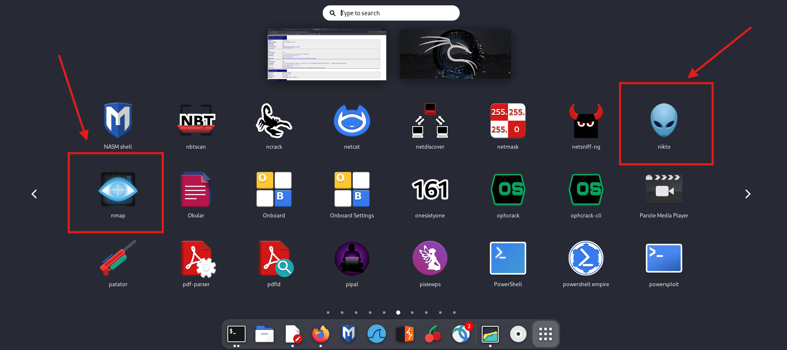

# Chuỗi bài viết về Web Application Security Testing Guide (OWASP Testing Project)
## Chủ đề Information Gathering (Thu thập thông tin)
## Bài 2. Fingerprint Web Server (WSTG-INFO-02)

Tài liệu gốc [WSTG-INFO-02 (OWASP)](https://owasp.org/www-project-web-security-testing-guide/latest/4-Web_Application_Security_Testing/01-Information_Gathering/02-Fingerprint_Web_Server)

## Tóm tắt  
**Fingerprint Web Server** tạm dịch là **dấu vết của máy chủ** là chương thứ 2 trong 10 chủ đề **Thu thập thông tin (Information Gathering)**.  

Chương này nói về việc thu thập thông tin loại máy chủ và phiên bản của máy chủ đang vận hành hệ thống như Apache, NginX, Lighttp,...Điều này khá quan trọng để chúng ta biết thông tin về nền tảng phục vụ cho quá trình kiểm thử bảo mật.
## Mục tiêu  
Xác định phiên bản và thể loại của máy chủ web đang chạy để cho phép khám phá nhiều hơn về bất kỳ lỗ hổng nào có thể biết được trên máy chủ.
## Cách thực hiện  
### **1. Banner Grabbing**  

**Banner Grabbing** dịch ra tiếng Việt là **Nắm lấy biểu ngữ**, mình thật sự không thích cách dịch này vì sẽ làm chúng ta khá khó hiểu và nó cũng không diễn tả chính xác về ngữ nghĩa. **Banner** trong ngữ cảnh này được định nghĩa là một văn bản được máy chủ hiển thị các thông tin chi tiết và phiên bản phần mềm chạy trên hệ thống.  

Với cách này, ta có thể nhận lại được thông tin **File Header Response** bằng cách gửi các **HTTP Request** bằng nhiều công cụ như **Telnet** cho **HTTP Request** hay **openssl** cho các request qua **TLS/SSL**. 

Dưới đây là 3 ví dụ thông tin **Response Header** trả về ta thấy được từ 3 máy chủ Apache, NginX và Lighttp khi ta gửi **HTTP Request**.

- Apache  
```
HTTP/1.1 200 OK
Date: Thu, 05 Sep 2019 17:42:39 GMT
Server: Apache/2.4.41 (Unix)
Last-Modified: Thu, 05 Sep 2019 17:40:42 GMT
ETag: "75-591d1d21b6167"
Accept-Ranges: bytes
Content-Length: 117
Connection: close
Content-Type: text/html  
...  
```
- NginX
```
HTTP/1.1 200 OK
Server: nginx/1.17.3
Date: Thu, 05 Sep 2019 17:50:24 GMT
Content-Type: text/html
Content-Length: 117
Last-Modified: Thu, 05 Sep 2019 17:40:42 GMT
Connection: close
ETag: "5d71489a-75"
Accept-Ranges: bytes
...
```  
- Lighttp
```
HTTP/1.0 200 OK
Content-Type: text/html
Accept-Ranges: bytes
ETag: "4192788355"
Last-Modified: Thu, 05 Sep 2019 17:40:42 GMT
Content-Length: 117
Connection: close
Date: Thu, 05 Sep 2019 17:57:57 GMT
Server: lighttpd/1.4.54
```
Khi nhìn vào 3 ví dụ trên, ta dễ dàng thấy được các trường thông tin về phiên bản HTTP, loại máy chủ và phiên bản, loại nội dung, ngày chỉnh sữa cuối cùng của file, trạng thái kết nối, trạng thái phản hồi (ví dụ như 200 OK),...  

Ngoài ra, ta còn có thể dựa vào **thứ tự sắp xếp các trường** để suy đoán ra loại máy chủ.  
* Ví dụ: Khi ta bắt gặp một phản hồi trả về với các trường được sắp xếp theo thứ tự như bên dưới, ta có thể xác định đây máy chủ đang chạy **NginX**. 
    * **Server**  
    * **Date**  
    * **Content-Type**

Tuy nhiên, xét rằng nếu có nhiều máy chủ khác nhau có thể chia sẽ các thứ tự trường giống nhau và các trường có thể bị chỉnh sửa hoặc gỡ bỏ thì phương pháp này không chắc chắn.   

### **2. Gửi các yêu cầu với form độc hại (Malformed Requests)**   

Máy chủ Web có thể được xác định thông qua việt kiểm tra các phản hồi lỗi của chúng. Trong trường hợp nếu các trang không được thiết kế trước để cung cấp đến người dùng 1 giao diện thông báo lỗi, thì lúc này thông báo lỗi "nguyên gốc" từ trang sẽ được hiển thị ra. Một cách để buộc máy chủ hiển thị ra các trang này là gửi các yêu cầu không đúng hoặc các form được chỉnh sửa **(Malform)** có chủ đích đến máy chủ.   

Để chỉnh sửa các **Request** trước khi gửi đi, có rất nhiều công cụ có thể giúp ta làm việc này. Một công cụ phổ biến và nổi tiếng mà nhiều Pentester rất hay sử dụng là **Burp Suite**.


Ví dụ: Ta sẽ gửi một HTTP Request đã dược chỉnh sửa với một phương thức không tồn tại mà ta tự tạo ra, ở đây ví dụ như ```SANTA CLAUS``` đến một máy chủ, ta sẽ nhận lại phản hồi như sau   


* Với Apache
```
GET / SANTA CLAUS/1.1


HTTP/1.1 400 Bad Request
Date: Fri, 06 Sep 2019 19:21:01 GMT
Server: Apache/2.4.41 (Unix)
Content-Length: 226
Connection: close
Content-Type: text/html; charset=iso-8859-1

<!DOCTYPE HTML PUBLIC "-//IETF//DTD HTML 2.0//EN">
<html><head>
<title>400 Bad Request</title>
</head><body>
<h1>Bad Request</h1>
<p>Your browser sent a request that this server could not understand.<br />
</p>
</body></html>
```  

* Với NginX
```
GET / SANTA CLAUS/1.1


<html>
<head><title>404 Not Found</title></head>
<body>
<center><h1>404 Not Found</h1></center>
<hr><center>nginx/1.17.3</center>
</body>
</html>
```
* Với lighttp
```
GET / SANTA CLAUS/1.1


HTTP/1.0 400 Bad Request
Content-Type: text/html
Content-Length: 345
Connection: close
Date: Sun, 08 Sep 2019 21:56:17 GMT
Server: lighttpd/1.4.54

<?xml version="1.0" encoding="iso-8859-1"?>
<!DOCTYPE html PUBLIC "-//W3C//DTD XHTML 1.0 Transitional//EN"
         "http://www.w3.org/TR/xhtml1/DTD/xhtml1-transitional.dtd">
<html xmlns="http://www.w3.org/1999/xhtml" xml:lang="en" lang="en">
 <head>
  <title>400 Bad Request</title>
 </head>
 <body>
  <h1>400 Bad Request</h1>
 </body>
</html>
```
Các trang lỗi xuất ra nhiều yếu tố khác nhau giữa các loại máy chủ Web, các bài kiểm tra có thể là một phương thức hiệu quả cho tìm kiếm dấu vết **(Fingerprinting)** kể cả khi các trường **header** của của máy chủ được che dấu.  

### **3. Sử dụng các công cụ quét tự động**   

Để bắt đầu một cách dễ dàng hơn, các công cụ hỗ trợ quét tự động là một lựa chọn tuyệt vời cho các Pentester. Ở đây, ta sẽ không phân tích sâu vào cơ chế hoạt động và đặc điểm cụ thể vì có khá nhiều công cụng khác nhau  đang có hiện nay.  

Trong tài liệu gốc từ OWASP, họ giới thiệu 3 công cụ khá phổ biến là:
* **Netcraft**, một công cụ quét thông tin máy chủ mà ta có thể sử dụng online trên giao diện web.
* **Nikto**, một công cụ mã nguồn mở có sẵn trên Kali Linux, hoặc ta cũng có thể tự cài đặt khá dễ dàng trên máy linux nếu chưa có.
* **Nmap**, không cần phải diễn tả nhiều, Nmap là một công cụ phải gọi là cực kỳ phổ biến và nổi tiếng trong công việc kiểm thử bảo mật.  

Với mình hiện tại khi viết tài liệu này thì mình thích nhất là **Nikto** vì cách sử dụng khá đơn giản và tốc độ quét cũng khá nhanh tạo sự tiện lợi và hiệu quả cao. So với **Nmap** có thể không bằng nhiều khía cạnh, tuy nhiên **Nmap** khá nhiều option phức tạp và và ta phải đợi kết quả khá lâu nếu quét full option. Thì với trong trường hợp chỉ kiểm tra này phản hồi thông tin máy chủ trả về, lựa chọn 1 công cụ tiện lợi như **Nikto** sẽ giúp ta tối ưu thời gian tốt hơn.

 Bên cạnh đó, còn có rất nhiều công cụ với mục đích tương tự mà mọi người có thể trãi nghiệm và tham khảo thêm. Nếu bạn có 1 máy **Kali Linux**, bạn sẽ có rất nhiều công cụ được cài sẵn để lựa chọn chứ không chỉ dừng lại ở 3 công cụ được giới thiệu như trong tài liệu.  
## Biện pháp khắc phục  

Như chúng ta đã biết, việc thông tin máy chủ bị tiết lộ cũng được xem là một lỗ hổng. Các Attacker có thể sử dụng thông tin này để phục vụ trong quá trình khai thác các lỗ hổng khác.  

Một ví dụ dễ hình dung nhất. Giả sử một phiên bản của nền tảng web hoặc dịch vụ bất kỳ hiện tại đang có  vấn đề về bảo mật và đã được thông tin rộng rãi. Máy chủ web của tổ chức đang sử dụng là các nền tảng và dịch vụ đang ở phiên bản đó. Thì điều gì sẽ xảy ra khi các Attacker kiểm tra phát hiện được điều này ?  

Để ngăn ngừa vấn đề này, OWASP đề xuất 3 hành động cần thiết như sau:  
* Che dấu thông tin máy chủ web trong phần **header**, chẳng hạng như với Apache's [mod_headers module](https://httpd.apache.org/docs/current/mod/mod_headers.html) vói máy chủ sử dụng Apache.
* Sử dụng một [**Reverse proxy server**](https://en.wikipedia.org/wiki/Proxy_server#Reverse_proxies) mạnh mẽ để tạo thêm một lớp bảo mật giữa máy chủ web và internet.
* Đảm bảo các máy chủ web là phiên bản mới nhất và cập nhật đầy đủ các bản vá bảo mật.