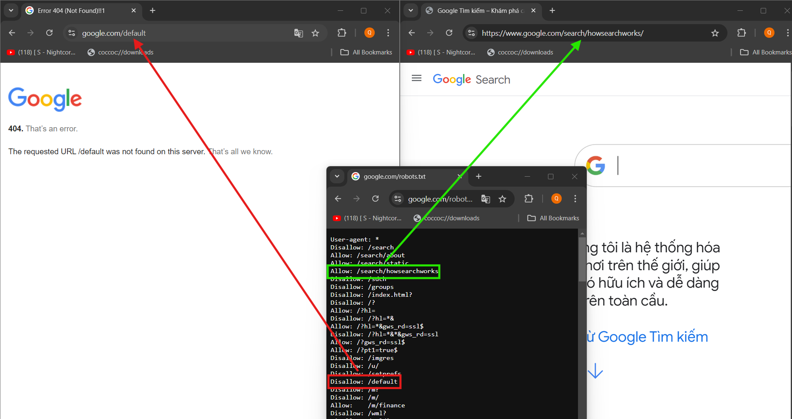
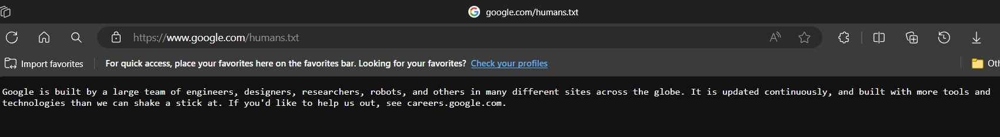

# Chuỗi bài viết về Web Application Security Testing Guide (OWASP Testing Project)
## Chủ đề Information Gathering (Thu thập thông tin)
## Bài 3. Review Webserver Metafiles for Information Leakage (WSTG-INFO-03)  
Tài liệu gốc [WSTG-INFO-03](https://owasp.org/www-project-web-security-testing-guide/latest/4-Web_Application_Security_Testing/01-Information_Gathering/03-Review_Webserver_Metafiles_for_Information_Leakage)  
## Tóm tắt
**Review Webserver Metafiles for Infomation leakage (Tìm kiếm thông tin thông qua dữ liệu rò rĩ từ các tệp tinh Metafile của máy chủ web)** là chương thứ 2 trong 10 chủ đề **Thu thập thông tin (Information Gathering)**  

Chương này mô tả  cách kiểm tra thông tin rò rĩ từ các **Metadata file** thông qua các đường dẫn ứng dụng web hay các hàm. Hơn thế nữa, danh sách của các thư mục cần tránh bởi "Spiders/Robots/Crawler" cũng có thể được tạo như là một sự phụ thuộc cho cho **[Map execution paths through application](https://owasp.org/www-project-web-security-testing-guide/latest/4-Web_Application_Security_Testing/01-Information_Gathering/07-Map_Execution_Paths_Through_Application)** (chủ đề này sẽ có 1 chương riêng, cụ thể là WSTG-INFO-07). Giải thích một chút vì câu này đọc khá khó hiểu:  
* Thứ nhất, dành cho các bạn chưa biết về Metadata file, nếu dịch ra tiếng Việt nó có nghĩa là **"Tệp tin siêu dữ liệu"**, nghe thật hoành tráng đúng không nào! Nhưng thật ra nó không hề khó hiểu. **Metadata file** là tệp lưu trữ các thông tin mô tả *tên file, loại, kích thước, ngày tạo, ngày chỉnh sửa,...* như .htaccess, robots.txt, hoặc sitemap.xml, các thông tin này cung cấp cho ta biết bối cảnh về nội dung của dữ liệu chứ **không chứa dữ liệu của bản thân các file**.
* Thứ hai, **Spider, Robot** và **Crawler** dịch ra đều mang nghĩ chung là nhện, con bọ, loài bò sát,...Trong ngữ cảnh kiểm thử xâm nhập, khi đề cập đến các "con" này, chúng ta thường được hiểu là các **Trình thu thập thông tin**, giống như một con bọ luồng lách vào các hệ thống và ứng dụng của chúng ta để khảo sát, lập chỉ mục hoặc xây cây đường dẫn trang web.  
* Thứ 3, về việc tạo danh sách của các thư mục cần tránh bởi "Spiders/Robots/Crawler"...Tức là các thư mục hay đường dẫn khi tạo ra được cấu hình để tránh con các con "bọ" thu thập thông tin có thể lần tới nhưng chúng ta vẫn có thể tạo ra được danh sách các file hay đường dẫn này thông qua việc truy cập các đường dẫn của ứng dụng.
## Mục tiêu kiểm tra
* Xác định các đường dẫn hoặc các chức năng bị che dấu thông qua phân tích **Metadata file**.
* Phân giải và liên kết các thông tin lại với nhau để hiểu hơn về hệ thống đang kiểm thử.
## Cách thực hiện
*Các ví dụ trong tài liệu này đều sử dụng công cụ **wget** và **curl** để hiển thị. Chúng ta có thể sử dụng các công cụ linh hoạt khác như **ZAP** của OWASP hay **Burp Suite** để kiểm tra hoặc phân tích cú pháp cho các ví dụ trong bài viết.*
### Robots
**Web Spiders**, **Robots** hay **Crawlers** lấy thông tin từ trang web và sau đó lặp lại hành động (đệ quy) thông qua các "Hyperlinks" (Các liên kết nằm trong ngay chính trang đang thực hiện tạo tác lấy thông tin) để lấy nhiều nội dung web hơn. Hành vi được chập nhận của các con "bọ" này được chỉ định rõ bởi [Robots Exclusion Protocol](https://www.robotstxt.org/) (giao thức loại trừ truy cập áp dụng cho các trình thu thập thông tin như Spider, Robot hay Crawler) của file [robots.txt](https://www.robotstxt.org/) trong thư mục root của web (Web root directory).  

Giải thích một xíu về file **robots.txt**. Đây là file mặc định hoặc lập trình viên có thể tạo ra trong ứng dụng web. Mục địch của nó như một trang hướng dẫn để biết rằng có cho phép hoặc không cho phép đối tượng A nào đó có thể truy cập đến đường dẫn B hay không. khi các con "bọ" tìm đến file **robots.txt** này thì nó sẽ duyệt theo danh sách đó làm cho việc đưa ra các chỉ mục của trang web có thể không đầy đủ để ta quan sát.  

Để rõ hơn, ta xem ví dụ một đoạn trích file robots.txt của Google ngày 20/08/2024 như dưới đây:
```
User-agent: *
Disallow: /search
Allow: /search/about
Allow: /search/static
Allow: /search/howsearchworks
Disallow: /sdch
Disallow: /groups
Disallow: /index.html?
Disallow: /?
Allow: /?hl=
Disallow: /?hl=*&
Allow: /?hl=*&gws_rd=ssl$
Disallow: /?hl=*&*&gws_rd=ssl
Allow: /?gws_rd=ssl$
Allow: /?pt1=true$
Disallow: /imgres
Disallow: /u/

...
```
Ở đây ta thấy, [User-Agent](https://developer.mozilla.org/en-US/docs/Web/HTTP/Headers/User-Agent) được chỉ định là `*` tức là tất cả các đối tượng có cả các con "bọ" Spipder, Robot hay Crawler ta đã đề cập. Tiếp sau đó là các dòng `Allow` và `Disallow` để ta biết được `User-Agent` được cho phép hay không cho phép truy cập vào các đường dẫn nào.  



Tuy nhiên, các Web spiders/robots/crawlers có thể cố tình bỏ qua các chỉ dẫn `Disallow`. Từ đây, **robots.txt** không nên được xem là một cơ chế để hạn chế nội dung web bị cập, lưu trữ hoặc tái xuất bản bởi bên thứ 3 mà ta cần các biện pháp an toàn khác "chính quy" hơn.

File **robots.txt** có thể lấy từ thư mục root của web (Web root directory) của máy chủ web. Ví dụ, ta tải file **robots.txt** từ **www.google.com** sử dụng `wget` hoặc `curl`:

```
curl -O -Ss http://www.google.com/robots.txt && head -n10 robots.txt
```
* `-O`: để xuất và lưu file, ở đây ta lưu với tên  robots.txt.
* `-s` và `-S`: 2 tùy chọn này thường đi chung với nhau với `-s` là silent mode tức là không thể hiện ra quá trình câu lệnh hoạt động và `-S` là hiện ra các hành động lỗi nếu quá trình hoạt động gặp phải. 2 tùy chọn này kết hợp với nhau, mỗi khi chạy lệnh, màn hình chỉ hiển thị các hành động lỗi nếu có.
* Lệnh `head` với tùy chọn `-n`: Lệnh `head` dùng đề hiển thị các dòng của file từ trên xuống dưới, trong đó tùy chọn `-n` là số dòng, ở đây ta muốn xem 10 dòng đầu.

Ta nhân được file **robots.txt** và xem 10 dòng đầu của nó
```
User-agent: *
Disallow: /search
Allow: /search/about
Allow: /search/static
Allow: /search/howsearchworks
Disallow: /sdch
Disallow: /groups
Disallow: /index.html?
Disallow: /?
Allow: /?hl= 
```
#### Phân tích robots.txt sử dụng Google Webmaster Tools
Chủ sở hữu website cũng có thể sử dụng tính năng "phân tích robots.txt" của Google -  Google Webmaster Tools hay hiện nay được gọi là Google Search Console


### Các nhãn META (META Tags)
Nếu thường xuyên lập trình front-end chắc sẽ không xa lạ gì với thẻ `<meta>`, là một thẻ  dùng để hướng dẫn các công cụ tìm kiếm (như Google, Bing,...) về cách xử lý trang web của bạn trong kết quả tìm kiếm.
#### Thẻ META Robots (Robots META Tag)
Như nhiều loại thẻ phổ biến khác, `<meta>` cũng có nhiều thuộc tính ví dụ như `name`, `property`, `http-equiv`,...và mỗi thuộc tính khi thiết lập ta thường phải kèm theo thuộc tính `content` để trình bày nội dung cụ thể của thuộc tính chính.  
* Ví dụ:
```
<meta name="description" content="Đây là chuỗi bài viết về WSTG.">
```
Các website có thể dùng thuộc tính `name` trong thẻ `<meta>`để ngăn chặn các trình thu thập thông tin theo công thức sau:
```
<html>
<head>
<title>...</title>
<META NAME="ROBOTS" CONTENT="NOINDEX, NOFOLLOW">
</head>
```
Ta thấy `<META NAME="ROBOTS" CONTENT="NOINDEX, NOFOLLOW">`chỉ ra đối tượng **ROBOTS** được gán với nội dung **NOTINDEX** và **NOTFOLLOW** tức là **KHÔNG CHỈ MỤC** và **KHÔNG THEO DÕI** khiến cho các trình thu thập không thể thấy và lập chỉ mục trên trang ta thiết lập.  

Dựa vào các thư mục được liệt kêt **robots.txt** trong webroot, một biểu thức chính quy tìm kiếm cho thẻ `<META NAME="ROBOTS"` được thực hiện trong mỗi trang web. Kết quả sau đó được so sánh với file **robots.txt** trong webroot.  

Nếu ta không viết đoạn `<META NAME="ROBOTS" CONTENT="NOINDEX, NOFOLLOW">` thì mặc định giao thức "Robots Exclusion Protocol" sẽ thiết lập **INDEX** và **FOLLOW** cho trang.
#### Các thẻ thông tin META khác (Miscellaneous META Information Tags)
Các tổ chức thường nhúng thông tin các thẻ **META** trong nội dung web để hỗ trợ nhiều đa dạng các tính năng xem và tìm kiếm như trình đọc màn hình, bản xem trước mạng xã hội, lập chỉ mục công cụ tìm kiếm,...Thông tin thẻ **META** có thể có giá trị cho các Tester trong việc xác định các công nghệ được sử dụng và các đường dẫn/tính năng khác để khai thác và kiểm tra. Dưới đây là thông tin **META** trong `<head>` được lấy từ **website Nhà Trắng** của Hoa Kỳ tại `www.whitehouse.gov` thông qua tính năng "View Page Source" trên trình duyệt, dữ liệu được hiển thị tại thời điểm 22/08/2024.
```
<head>
	<meta charset="utf-8">
	<meta name="google" content="notranslate">
	<meta http-equiv="X-UA-Compatible" content="IE=edge">
	<meta name="viewport" content="width=device-width, initial-scale=1">
	<link rel="profile" href="https://gmpg.org/xfn/11">
	
	<!-- If you're reading this, we need your help building back better. https://usds.gov/ -->
<meta name="robots" content="index, follow, max-image-preview:large, max-snippet:-1, max-video-preview:-1">

	<title>The White House</title>
	<meta name="description" content="President Biden and Vice President Harris promised to move quickly to deliver results for working families. That’s what they’ve done.">
	<link rel="canonical" href="https://www.whitehouse.gov/">
	<meta property="og:locale" content="en_US">
	<meta property="og:type" content="website">
	<meta property="og:title" content="The White House">
	<meta property="og:description" content="President Biden and Vice President Harris promised to move quickly to deliver results for working families. That’s what they’ve done.">
	<meta property="og:url" content="https://www.whitehouse.gov/">
	<meta property="og:site_name" content="The White House">
	<meta property="article:publisher" content="https://www.facebook.com/WhiteHouse/">
	<meta property="article:modified_time" content="2022-01-31T03:46:42+00:00">
	<meta property="og:image" content="https://www.whitehouse.gov/wp-content/uploads/2021/01/wh_social-share.png">
	<meta property="og:image:width" content="1200">
	<meta property="og:image:height" content="630">
	<meta property="og:image:type" content="image/png">
	<meta name="twitter:card" content="summary_large_image">
	<meta name="twitter:site" content="@whitehouse">
...
</head>
```
### Các sơ đồ trang (Sitemaps)
**Sitemap.xml** là một file nơi lập trình viên hay một tổ chức có thể cung cấp thông tin về các trang web, video, và các file khác được sắp xếp bởi site hoặc ứng dụng; kèm theo đó là mối liên hệ giữa chúng. Công cụ tìm kiếm có thể sử dụng file **sitemap.xml** này để điều hướng site của bạn một cách hiệu quả hơn. Tương tự, các Tester có thể tận dụng file **sitemap.xml** để nhận được nhiều thông tin chi tiết sâu hơn ở trong site và ứng dụng dưới sự điều tra.

Cùng xem trích đoạn của file sitmap của Google ngày 22/08/2024
```
wget --no-verbose https://www.google.com/sitemap.xml && head -n8 sitemap.xml
```
* **wget**: Tương tự **curl**, sử dụng phụ vụ việc tải các tệp tinh về.
* **--no-verbose**: Không dài dòng, tức là không hiển thị quá trình tải.
* **head -n8**: hiển thị 8 dòng đầu của file.

Ta nhận được kết quả như bên dưới
```
2024-08-22 15:21:59 URL:https://www.google.com/sitemap.xml [2139/2139] -> "sitemap.xml" [1]
<?xml version="1.0" encoding="UTF-8"?>
<sitemapindex xmlns="http://www.google.com/schemas/sitemap/0.84">
  <sitemap>
    <loc>https://www.google.com/gmail/sitemap.xml</loc>
  </sitemap>
  <sitemap>
    <loc>https://www.google.com/forms/sitemaps.xml</loc>
  </sitemap>
                                                                        ...                                                                     
```
Từ đây, Tester có thể khám phá thêm về các gmail trong `https://www.google.com/gmail/sitemap.xml` hoặc các sitemap khác từ kết quả nhận về.


### Security TXT
[security.txt](https://securitytxt.org/) đã được chấp nhận bởi tổ chức [IETF](https://www.ietf.org/about/introduction/) như là [RFC 9116 - A File Format to Aid in Security Vulnerability Disclosure](https://www.rfc-editor.org/rfc/rfc9116.html) (Một định dạng file cho việc hỗ trợ tiết lộ lỗ hổng bảo mật). File này cho phép các site xác định các chính sách bảo mật và các chi tiết liên lạc. Có nhiều lý do cho việc tại sao điều này có thể được quan tâm trong các kịch bản kiểm tra, nó bao gồm nhưng không giới hạn đế các vấn đề dưới đây:
* Xác định nhiều hơn các đường dẫn và các tài nguyên cho việc khám phá và phân tích.
* Tập hợp mã nguồn mở một cách thông minh.
* Tìm kiếm thông tin trên các khoản tiền thường từ Bug.
* Kỹ thuật xã hội.

File thường được đặt tại đường dẫn gốc (Webroot) hoặc thư mục `well-know/`. Xem ví dụ bên dưới.
```
https://example.com/security.txt
https://example.com/.well-known/security.txt
```
Dưới đây là một ví dụ từ trang Linkedln , ta sẽ quan sát file **security.txt** của nó vào ngày 22/08/2024. Như ta có thể thấy các đường dẫn được liệt kê trong file có thông tin liên hệ chỉ đến trang của **Hacker One** một công ty về lĩnh vực hacking và bảo mật có hợp tác với **Linkedln**, chúng ta có thể theo đường dẫn để khám phá thêm.

 
```
wget --no-verbose https://www.linkedin.com/.well-known/security.txt && cat security.txt

2024-08-22 16:46:36 URL:https://www.linkedin.com/.well-known/security.txt [267/267] -> "security.txt" [1]
# Conforms to IETF `draft-foudil-securitytxt-07`
Contact: https://hackerone.com/linkedin
Contact: https://www.linkedin.com/help/linkedin/answer/62924
Canonical: https://www.linkedin.com/.well-known/security.txt
Policy: https://hackerone.com/linkedin?view_policy=true
                                                             
```
Thêm ví dụ khác với **Google**. 


```
wget --no-verbose https://www.google.com/.well-known/security.txt && cat security.txt

2024-08-23 13:09:52 URL:https://www.google.com/.well-known/security.txt [275/275] -> "security.txt.1" [1]
# Conforms to IETF `draft-foudil-securitytxt-07`
Contact: https://hackerone.com/linkedin
Contact: https://www.linkedin.com/help/linkedin/answer/62924
Canonical: https://www.linkedin.com/.well-known/security.txt
Policy: https://hackerone.com/linkedin?view_policy=true

```
Với file **security.txt** có 1 dòng **Encryption:** `https://services.google.com/corporate/publickey.txt`. Đây là một **OpenPGP public key**, [**OpenPGP**](https://www.openpgp.org/) là tiêu chuẩn mã hóa mail được sử dụng rộng rãi nhất.


Các **OpenPGP Public Key** (Khóa công khai OpenPGP) chứa vài metadata có thể cung cấp thông tin về key của chính nó. Một vài thẻ metadata phổ biến có thể được trích xuất từ một **OpenPGP Public Key**:
* **Key ID**: Là một mã định danh ngắn có được lấy từ dãi mã và thông tin của public key (public key material). Nó giúp xác định key và thường được biểu diễn dưới một giá trị 8 ký tự trong hệ thập lục phân.
* **Key fingerprint**: Là một mã định danh dài hơn và duy nhất được lấy từ dãi mã và thông tin của public key (public key material). Nó thường được biểu diễn dưới một giá trị 40 ký tự trong hệ thập lục phân. Các key fingerprint thường được sử dụng để xác minh tính toàn vẹn và tính xác thực của một public key. 
* **Key Algorithm**: Là thuật toán mã hóa được sử dụng bởi một public key. **OpenPGP** hỗ trợ nhiều loại thuật toán mã hóa như RSA, DSA và ECC (Elliptic Curve Cryptography).
* **Key size**: Liên quan đến độ dài hoặc kích thước của khóa mã hóa trong đơn vị bit. Nó chỉ ra độ mạnh của khóa và xác dịnh cấp độ bảo mật được cung cấp bởi khóa.
* **Key Creation Date**: Ngày key được tạo hoặc phát hành.
* **Key Expriation Date**: Ngày key hết hạn. OpenPGP Public Key có thể có một thiết lập hết hạn, sau đó chúng được xem như là không còn giá trị.
* **User IDs**: Các Public key có thể có một hay nhiều hơn các User ID được kết hợp	với nhau để xác định chủ sở hữu hoặc thực thể được kết hợp với key.Các User ID điển hình bao gồm thông tin như tên, địa chỉ email và các bình luận tùy chọn của chủ sở hữu key.	

### Humans TXT
**Humans TXT** là một khởi tạo để biết người đứng sau một site. Nó có dạng một tệp tin văn bản chứa thông tin về những người khác nhau, những người đã phát hành cho sự xây dựng site. File này thường (nhưng không luôn luôn) chứa thông tin liên quan đến các site hoặc đường dẫn chứa thông tin về sự nghiệp hoặc nghề nghiệp.

Dưới đây là thông tin file **humans.txt** được xem tại thời điểm 22/08/2024.


```
Google is built by a large team of engineers, designers, researchers, robots, and others in many different sites across the globe. It is updated continuously, and built with more tools and technologies than we can shake a stick at. If you'd like to help us out, see careers.google.com.
```
### Các nguồn thông tin khác trong .well-know
Có các RFC (Request for Comments) và bản thảo  internet khác đề suất chuẩn hóa các cách sử dụng của các file trong thư mục `well-know/` .well-know ở đây tức là các tên tiền tố URI ( Uniform Resource Identifier), ở đây ta hiểu đơn giản là cách tạo lâp và đặt tên cho các thư mục khi xây dựng web. Trong các ví dụ ở các phần trên, ta thấy các file **security.txt** khi được tạo khuyến nghị theo chuẩn **RFC 9116**, điều này không bắt buộc nhưng được khuyến nghị tuân thủ. Danh sách của chúng có thể tìm thấy trong [Well-known URI của Wikipedia](https://en.wikipedia.org/wiki/Well-known_URI#List_of_well-known_URIs) hay [Well-Known URIs của iana.org](https://www.iana.org/assignments/well-known-uris/well-known-uris.xhtml).	
## Các công cụ (Tools)
Trong chương này, một số công cụ phổ biến giúp ta tìm kiếm và quan sát các thông tin meta Files như:
* **curl** và **wget** hỗ trợ việc lưu các file một cách nhanh chóng.
* **Burp Suite** và **ZAP** nhiều tính năng và mạnh mẽ hơn có thể dùng để fuzzing (Phân rã) các ứng dụng giúp lập chỉ mục và tạo cây đường dẫn.
* **Trình duyệt** để xem mã nguồn (Source) và sử dụng các công cụ Dev (Dev Tools functionality).
