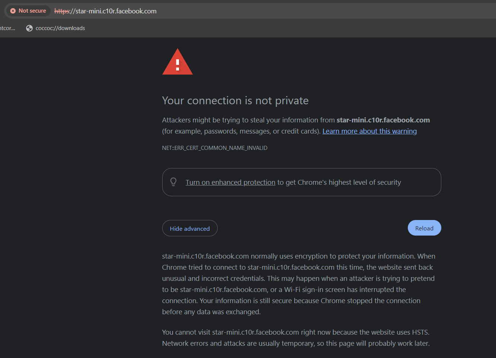
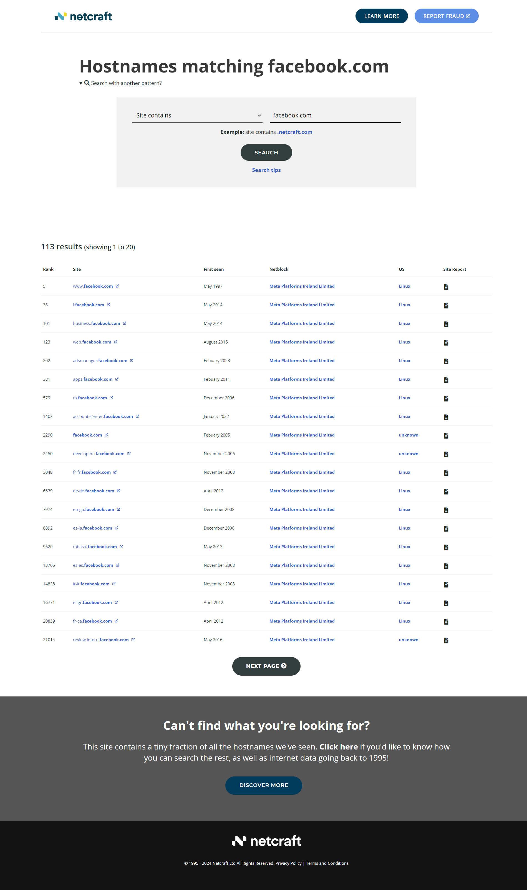
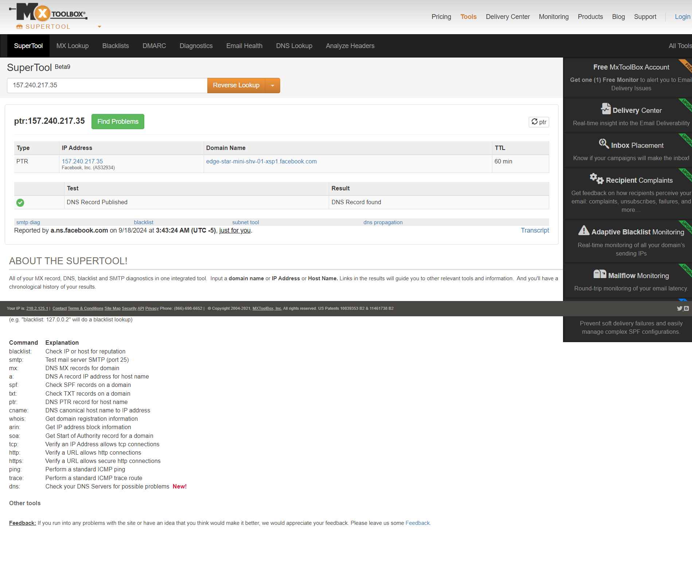
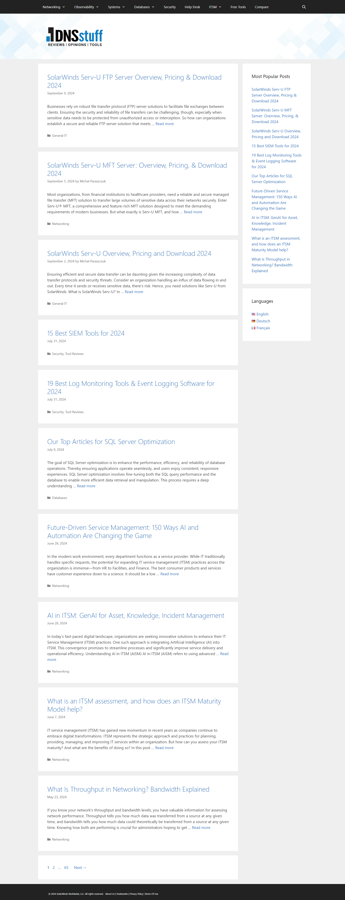
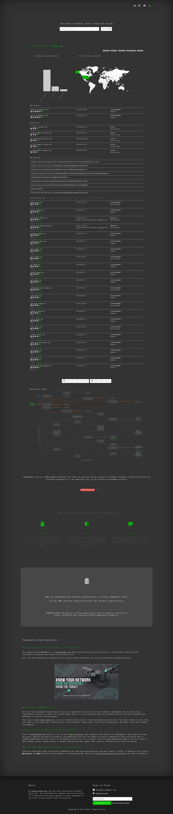
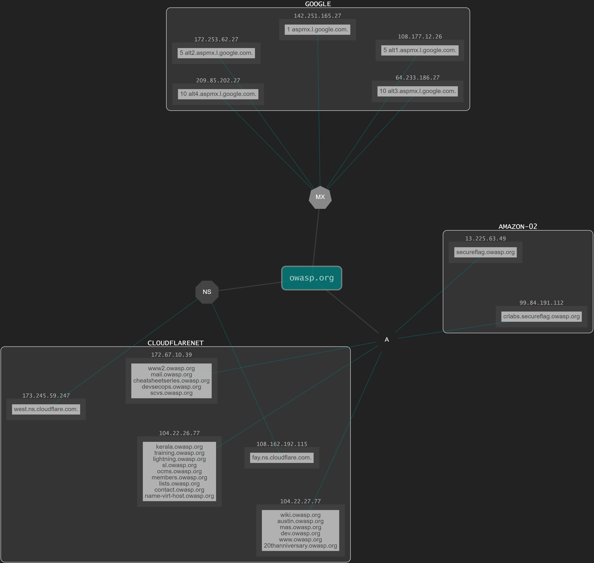

# Chuỗi bài viết về Web Application Security Testing Guide (OWASP Testing Project)
## Chủ đề Information Gathering (Thu thập thông tin)
## Bài 4. Enumerate Applications on Webserver (WSTG-INFO-04)  
Tài liệu gốc [WSTG-INFO-04](https://owasp.org/www-project-web-security-testing-guide/latest/4-Web_Application_Security_Testing/01-Information_Gathering/04-Enumerate_Applications_on_Webserver)  
## Tóm tắt
**Enumerate Applications on Webserver (WSTG-INFO-04) (Liệt kê các ứng dụng trên máy chủ web)** là bài thứ 4 trong 10 chủ đề **Thu thập thông tin (Information Gathering)**  

Một bước tối quan trọng trong khiểm tra các lỗ hổng trên ứng dụng web là tìm ra ứng dụng cụ thể đang chạy trên máy chủ web. Nhiều ứng dụng đã được biết các lỗ hổng và biết cách khai thác các lỗ hổng đó để đạt được quyền điều khiển hoặc khai thác dữ liệu trên máy chủ. Thêm vào đó, nhiều ứng dụng thường không được cấu hình hoặc không được cập nhật, vì có một sự nhận thức thiếu sót rằng các ứng dụng chỉ được sử dụng "nội bộ" và do đó không tồn tại bất kỳ mối đe dọa nào hoặc điển hình có nhiều tổ chức chỉ triển khai các hệ thống bảo vệ như tường lửa hay proxy và cho rằng là đủ và không kiểm tra bảo mật các ứng dụng lớp trong. Với sự phát triển của các máy chủ web ảo, mối quan hệ truyền thống 1:1 giữa một địa chỉ IP và một máy chủ đã mất đi nhiều ý nghĩa ban đầu của nó. Không hiếm khi có nhiều site hay ứng dụng mà các tên đại diện của chúng được phân giải đến cùng địa chỉ IP. Kịch bản này không chỉ giới hạn trên các môi trường lưu trữ (Hosting environments), mà còn áp dụng đến các môi trường doanh nghiệp thông thường.

Các chuyên gia bảo mật thỉnh thoảng nhận một bộ các địa chỉ IP như là một mục tiêu để kiểm tra. Có thể nói rằng kịch bản này giống với một quy ước kiểu kiểm thử xâm nhập, nhưng trong bất kỳ trường hợp nào nó được mong đợi như một bài kiểm tra, nó sẽ kiểm tra tất cả các ứng dụng web có khả năng truy cập thông qua mục tiêu này (Nghĩa là khi nhận danh sách địa chỉ cần kiểm tra, nhưng họ có thể kiểm tra ra nhiều hơn ứng dụng ẩn có thể truy cập được thông qua các địa đó). Có một vấn đề rằng một địa chỉ IP chạy dịch vụ ```HTTP``` trên cổng ```80```, nhưng nếu Tester có thể truy cập nó thông qua việc chỉ định rõ địa chỉ IP (Địa chỉ mà tất cả Tester đều biết) và nó xuất ra thông báo rằng *"No web server configured at this address"* hoặc các thông điệp tương tự thì tức là họ số cổng họ truy cập không có site hoặc ứng dụng nào được cấu hình lên mặc dù đúng địa chỉ IP. Hoặc cũng có thể nói rằng hệ thống đó dường như đã ẩn đi một số ứng dụng, liên kết đến các tên đại diện (DNS) không liên quan. Rõ ràng, phạm vi mở rộng của việc phân tích bị ảnh hưởng sâu trong việc phụ thuộc vào liệu Tester có kiểm tra tất cả các ứng dụng hay không hay chỉ mỗi các ứng dụng mà họ nhận ra.

Đôi khi, đặc điểm của mục tiêu dồi dào hơn. Một Tester nhận được một danh sách các địa chỉ IP và các tên đại diện tương ứng với các địa chỉ ấy. Tuy nhiên, danh sách này có thể chỉ truyền tải một phần thông tin, điều đó có nghĩa là nó có thể bỏ qua một vài tên đại diện và client có thể không nhân ra điều đó (Điều này thường xảy ra với các tổ chức lớn).

Một số vấn vấn đề khác ảnh hưởng đến phạm vi của bài kiểm tra được thể hiện thông qua các ứng dụng web được phát hành tại các URL không rõ ràng (ví dụ ```http://www.example.com/some-strange-URL```), và điều này không được tham chiếu ở nơi khác. Nó có thể xảy ra bởi lỗi (vì thiếu cấu hình) hoặc cố tình (ví dụ như các giao diện quản trị không được quảng bá).

Để chỉ ra các vấn đề này, rất cần thiết để thực việc **khám phá các ứng dụng web**.

## Mục tiêu kiểm tra
* Liệt kê các ứng dụng tồn tại trên một máy chủ
## Cách kiểm tra
Khám phá ứng dụng web là một quá trình đạt được mục tiêu xác định các ứng dụng web trên một hạ tầng. Thứ sau đó thường được chỉ định như là một bộ địa chỉ IP (có thể gọi là một net block - Khối máy chủ trong mạng), nhưng cũng có thể chứa một bộ tên đại diện DNS hoặc cũng có thể có cả 2 điều trên. Thông tin này được trao ưu tiên cho bài kiểm tra thực thi, đây là một phong cách cơ bản của kiểm thử xâm nhậm hay một bài kiểm tra các ứng dụng được thực thi. Trong cả 2 trường hợp, trừ khi các quy tắc của cam kết chỉ định rõ (ví dụ kiểm tra mỗi ứng dụng trên URL ```http://www.example.com/```), nếu không thì bài kiểm tra phải cố gắng trở nên hoàn thiện nhất trong phạm vi, tức là nó phải xác định toàn bộ các ứng dụng có thể truy cập thông qua các mục tiêu được đề ra. Theo dõi các ví dụ kiểm tra một vào công nghệ sau có thể sử dụng để đạt được mục đích.

*Một vài công nghệ sau đây áp dụng đến các máy chủ tiếp xúc Internet, cụ thể là DNS, các dịch vụ tìm kiếm dựa trên  dịch ngược IP web và cách sử dụng các công cụ tiềm kiếm. Các ví dụ sử dụng của các địa chỉ IP private (chẳng hạn như 192.168.1.100), điều này trừ khi được chỉ định ở khía cạnh khác, nếu không thì các địa chỉ IP chung mang tính đại diện và được sử dụng chỉ duy nhất cho mục đích ẩn danh.*

Có **3 yếu tố** ảnh hưởng đến cách các ứng dụng được liên kết đến tên DNS (hoặc một địa chỉ IP)

1. **Các đường dẫn ứng dụng khác nhau (Different Base URL)**  
    Điểm truy cập rõ ràng cho một ứng dụng web là ```www.example.com```, ví dụ với từ khóa viết tắt này chúng ta nghĩ về ứng dụng web xuất phát từ ```http://www.example.com``` (tương tự cho HTTPS). Tuy nhiên, mặc dù đây là một trường hợp phổ biến nhất, nhưng không có nghĩa là ứng dụng sẽ bắt đầu tại ```/```.

    Ví dụ, các tên ký tự giống nhau có thể được liên kết tới 3 ứng dung web như sau: 
    ```
    https://www.example.com/app1
    ```       
    ```
    https://www.example.com/app2
    ```  
    ```
    https://www.example.com/app3
    ```  
    Trong trường hợp này, đường dẫn ```http://www.example.com/``` có thể không được liên kết với một trang đúng nghĩa. Cả 3 ứng dụng có thể duy trì **ẩn** trừ khi Tester biết được toàn bộ cách truy cập vào chúng, ví dụ Tester biết *app1*, *app2*, *app3*. Thông thường, không cần thiết công khai các ứng dụng web theo cách này; trừ khi chủ sử hữu không muốn chúng có khả năng bị truy cập bằng cách thông thường, và được chuẩn bị để thông tin cho các người dùng về vị trí chính xác của họ khi họ truy cập web. Điều này không có nghĩa là các ứng dụng này riêng tư, chỉ là sự tồn tại và vị trí của chúng không được quản bá đầy đủ.
2. **Các cổng không có tiêu chuẩn (Non-Standard Ports)**  
    Trong khi các ứng dụng thường hoạt động trên cổng ```80 (HTTP)``` và ```443 (HTTPS)```, không có gì cố định hoặc bắt buột về các cổng này. Trên thực tế, các ứng dụng có thể kết hợp với các cổng TCP bất kỳ, và có thể được tham chiếu bởi chỉ định cổng cụ thể như sau: ```http[s]://www.example.com:port/```.  

    Ví dụ: 
    ```
    https://www.example.com:20000/
    ```   
3. **Máy ảo (Virtual Hots)**  
DNS cho phép một địa chỉ IP liên kết với một hoặc nhiều tên đại diện. Ví dụ, địa chỉ IP ```192.168.1.100``` có thể được liên kết với 3 DNS 
    ```
    www.example.com
    ```
    ```
    helpdesk.example.com
    ```
    ```
    webmail.example.com
    ```
Không cần thiết rằng tất cả các tên thuộc cùng một tên miền DNS. Mối quan hệ ```1 - N``` này có thể được ảnh xạ đến các nội dung phục vụ khác nhau bằng việc sử dụng các **máy chủ ảo (virtual host)** được gọi. Thông tin chỉ định máy chủ ảo chúng ta đang liên hệ đến được nhúng trong **HTTP 1.1 [Host header](https://tools.ietf.org/html/rfc2616#section-14.23)**.

Người ta sẽ không nghi ngờ sự tồn tại của các ứng dụng web khác được thêm vào ```www.example.com``` một cách rõ ràng, trừ khi họ biết được ```helpdesk.example.com``` và ```webmail.example.com```.

### Các cách tiếp cận giải quyết vấn đề 1 - Non-standard URLs

Không có cách nào khám phá ra một cách đầy đủ sự tồn tại của các ứng dụng web có tên chuẩn. Không tiêu chuẩn, không có tiêu chí cố định nào quản lý quy ước tên, tuy nhiên có một số công nghệ mà Tester có thể sử dụng để lấy được thêm vài thông tin sâu hơn.

**Đầu tiên**, nếu máy chủ web không được cấu hình và cho phép duyệt thư mục, nó có thể có khả năng chỉ ra các ứng dụng này. Các công cụ rà quét lỗ hổng có thể giúp chúng ta trong mặt này.

**Thứ hai**, các ứng dụng này có thể được tham chiếu bởi các trang web khác và có khả năng chúng đã được thu thập và lập chỉ mục bởi các công cụ tìm kiếm trên web. Nếu các Tester nghi ngờ sự tồn tại của các ứng dụng **ẩn** trên máy chủ chẳng hạn như ```www.example.com```, họ có thể sử dụng cách tìm kiếm với từ khóa *site* và kiếm tra kết quả của truy vấn cho ```site: www.example.com```. Giữa các URL trả về có thể có một chỉ điểm đến một ứng dụng không rõ ràng (Non-obvious application).

Một tùy chọn khác là thăm dò các URL để có thể chỉ ra các ứng dụng không được công khai. Ví dụ, một frontend của web mail có khả năng bị truy cập từ các URL như:
```
https://www.example.com/webmail
```  
```
https://webmail.example.com/
```
hoặc
```
https://mail.example.com/
```
Điều tương tự như vậy đúng với các giao diện quản trị, điều này có thể được công khai tại các URL ẩn (ví dụ, một giao diện quản trị Tomcat của dịch vụ Apache) và chưa được tham chiếu ở bất kỳ đâu. Vì vậy hãy làm một chút thao tác tìm kiếm thư mục (hoặc "phán đoán thông minh") có thể cho ra một vài kết quả. Các công cụ rà quét lỗ hổng có thể giúp chúng ta trong mặt này.

### Các cách tiếp cận giải quyết vấn đề 2 - Non-standard Ports

Dễ dàng để kiểm tra sự tồn tại của các ứng dụng web trên các cổng không chuẩn. Một công cụ quét **"PORT"** như Nmap có khả năng thực hiện các nhận dạng dịch vụ bằng tùy chọn ```-sV``` và sẽ xác định dịch vụ **HTTP[S]** trên các cổng bất kỳ nào. Thứ được yêu cầu là một lần quét "full scan" cho 65535 cổng TCP. 

Ví dụ, câu lệnh **Nmap** dưới đây sẽ tìm kiếm tât cả các các cổng TCP đang mở và cố gắng xác định các dịch vụ đang chạy trên mỗi cổng TCP tương tứng đó tại địa chỉ ```192.168.10.100``` (Ở đây ta chỉ đưa ra những dòng cần thiết)
```
nmap –Pn –sT –sV –p0-65535 192.168.1.100
```
```-Pn```: Tùy chọn này yêu cầu nmap bỏ qua bước quét Ping trước khi quét các cổng. Thông thường, Nmap sẽ thực hiện quét Ping để kiểm tra xem mục tiêu có đang hoạt động hay không. Với tùy chọn -Pn, Nmap sẽ quét tất cả các cổng bất kể có trả lời Ping hay không.

```-sT```: Đây là tùy chọn quét TCP kết nối đầy đủ (Full TCP Connect Scan). Khi sử dụng quét này, Nmap sẽ thiết lập kết nối TCP đầy đủ (SYN, SYN-ACK, ACK), tức là thực hiện bắt tay 3 bước. Phương pháp này có độ tin cậy cao hơn nhưng chậm hơn vì nó phải thiết lập và đóng kết nối hoàn chỉnh.

```-sV```: Tùy chọn này yêu cầu Nmap thực hiện phát hiện phiên bản dịch vụ đang chạy trên các cổng mở. Điều này giúp bạn biết dịch vụ nào (ví dụ: HTTP, FTP, SSH) và phiên bản cụ thể của nó đang chạy trên hệ thống đích.

```-p0-65535```: Tùy chọn này chỉ định Nmap quét toàn bộ các cổng từ 0 đến 65535. Đây là toàn bộ dải cổng có thể trên một hệ thống.

Với lệnh trên, ta có thể để kiểm tra một cách đầy đủ kết quả đầu ra và tìm kiếm HTTP hay dấu hiệu của các dịch vụ TLS (điều này có thể được thăm dò để xác nhận chúng là HTTPS). Ví dụ, kết quả của lệnh quét ```nmap –Pn –sT –sV –p0-65535 192.168.1.100``` sẽ như thế này:

```
Interesting ports on 192.168.1.100:
(The 65527 ports scanned but not shown below are in state: closed)
PORT      STATE SERVICE     VERSION
22/tcp    open  ssh         OpenSSH 3.5p1 (protocol 1.99)
80/tcp    open  http        Apache httpd 2.0.40 ((Red Hat Linux))
443/tcp   open  ssl         OpenSSL
901/tcp   open  http        Samba SWAT administration server
1241/tcp  open  ssl         Nessus security scanner
3690/tcp  open  unknown
8000/tcp  open  http-alt?
8080/tcp  open  http        Apache Tomcat/Coyote JSP engine 1.1
```
Từ ví dụ trên, ta có thể thấy:
    
* Trên cổng **80** có một dịch vụ Apache ```HTTP``` server đang chạy.
* Trên cổng **443** có một dịch vụ giống ```HTTPS```  (nhưng ta cần xác nhận lại, trong ví dụ lần này ta có thể truy cập đến địa chỉ với phương thức HTTPS trên trình duyệt ```https://192.168.1.100```). 
* Trên cổng **901** có giao diện quản trị Samba SWAT.
* Trên cổng **1241** không phải là là dịch vụ ```HTTPS``` mà là *"TLS-wrapped Nessus daemon"* (dịch vụ mã hóa TLS phụ vụ việc giao tiếp giữa Nessus Client và Nessus Server).
* Cổng **3690** là một dịch vụ không xác định (Nmap trả về *"fingerprint"* của nó - ở đây lượt bỏ để rõ ràng hơn - cùng với các hướng dẫn để gửi nó cho việc tổ chức trong cơ sỡ dữ liệu *fingerprint* Nmap, miễn là bạn biết nó đại diện cho dịch vụ nào).
* Trên cổng **8000** có một dịch vụ không xác định; đây có thể là ```HTTP```, vì không hiếm để tìm dịch vụ  server trên cổng này. Cùng kiểm tra nó thử xem:

```
$ telnet 192.168.10.100 8000
Trying 192.168.1.100...
Connected to 192.168.1.100.
Escape character is '^]'.
GET / HTTP/1.0

HTTP/1.0 200 OK
pragma: no-cache
Content-Type: text/html
Server: MX4J-HTTPD/1.0
expires: now
Cache-Control: no-cache

<html>
...
```
Điều này xác nhận rằng thực tế đây là một ```HTTP``` server. Ngoài ra, các Tester có thể truy cập các URL với trình duyệt web để kiểm tra; hoặc sử dụng các lệnh ```GET``` hay ```HEAD```, điều này bắt chước các tương tác HTTP chẳng hạn như kế quả được đưa ra ở trên (tuy nhiên các yêu cầu **HEAD** có thể không được chấp nhân bởi tất cả các máy chủ).

* Trên cổng **8080** đang chạy dịch vụ Apache Tomcat.

Nhiệm vụ giống nhau có thể được thực hiện bởi công cụ quét lỗ hổng, nhưng đầu tiên kiểm tra rằng công cụ quét trong sự lựa chọn có khả năng xác định dịch vụ ```HTTP[S]```đang chạy trên các cổng không chuẩn hay không. Ví dụ, **Nessus** có khả năng xác định chúng trên các cổng bất kỳ (miễn là nó được thiết lập để quét tất cả các cổng), và sẽ cung cấp cho chúng ta, đóng góp thêm và tham chiếu đến **Nmap**, số lượng bài kiểm tra trên các lỗ hổng máy chủ web được biết, cũng như là trên cấu hình ```TLS/SSL``` của các dịch vụ ```HTTPS```. Như đã gợi ý trước đó, **Nessus** cũng có khả năng chỉ ra các ứng dụng hay các giao diện web phổ biến mà lẽ ra không được chú ý (ví dụ: giao diện quản trị Tomcat) 

### Các cách tiếp cận giải quyết vấn đề 3 - Virtual Hosts

Có một số kỹ thuật có thể được sử dụng để xác định các tên DNS liên quan đến một địa chỉ IP.

#### DNS Zone Transfers

Kỹ thuật này đã được sử dụng hạn chế trong ngày nay, một sự thật được đưa ra rằng các **"Zone Transfer" (Vùng chuyển đổi)** lớn không được chấp nhận bởi các máy chủ DNS. Tuy nhiên, có thể đáng để thử. Đầu tiên, các Tester phải xác định các **NS - Name Server (máy chủ nắm tên miền)** đang phục vụ địa chỉ IP cần kiểm tra chẳng hạng như ```x.y.z.t```. Nếu tên đại diện được biết cho ```x.y.z.t``` (ví dụ như ```wwww.example.com```), các **Name Server** của nó có thể được xác định bằng các công cụ chẳng hạn như ```nslookup```, ```host``` hay ```dig``` với các yếu cầu để thu thập các **DNS NS record**. 

Nếu không có tên đại diện nào được biết, nhưng việc xác định mục tiêu chứa ít nhất một tên đại diện, các Tester có thể cố gắng áp dụng cùng một quá trình và truy vấn **Name Server** của tên miền đó (Hy vọng rằng ```x.y.z.t``` cũng sẽ được dịch ngược bởi tên **Name Server**). Ví dụ, nếu mục tiêu chứa địa chỉ IP ```x.y.z.t``` và tên miền là ```mail.example.com```, hãy xác định các máy chủ nắm tên miền cho ```example.com```.

Theo dõi ví dụ sau để xác định các **Name Server** cho Website của **Facebook** bằng cách sử dụng công cụ ```host``` với tùy chọn ```-t```.

Sử dụng lệnh ```host [-t type] hostname/IP```. Trong đó:

```-t```: Chỉ định loại truy vấn, kèm theo tên kiểu **NS record** như ```ns```, ```SOA```, ```txt```, ```A```,...

```hostname/IP```: Là địa chỉ của máy chủ web có thể là tên miền hoặc địa chỉ IP.

```
┌──(root㉿quoc)-[/home/doanhquoc]
└─#  host -t ns fb.com       
fb.com name server c.ns.facebook.com.
fb.com name server b.ns.facebook.com.
fb.com name server a.ns.facebook.com.
fb.com name server d.ns.facebook.com.
```
Hoặc 
```                            
┌──(root㉿quoc)-[/home/doanhquoc]
└─#  host -t ns facebook.com 
facebook.com name server a.ns.facebook.com.
facebook.com name server c.ns.facebook.com.
facebook.com name server d.ns.facebook.com.
facebook.com name server b.ns.facebook.com.
```
Ta thử thêm với tên miền ```wwww.fb.com```. Thấy rằng nó chỉ là tên bí danh cho ```wwww.facebook.com``` và bản thân nó lại là bí danh cho ```star-mini.c10r.facebook.com```, sau đó ta tiếp tục thử lần nữa và không phát hiện **NS record**.
```
┌──(root㉿quoc)-[/home/doanhquoc]
└─# host -t ns www.fb.com       
www.fb.com is an alias for www.facebook.com.
www.facebook.com is an alias for star-mini.c10r.facebook.com.

             
┌──(root㉿quoc)-[/home/doanhquoc]
└─#  host -t ns star-mini.c10r.facebook.com
star-mini.c10r.facebook.com has no NS record
```
Tiếp tục khám phá ```star-mini.c10r.facebook.com``` để xem tên miền này sẽ đi đến đâu, nhưng rất tiếc nó đã được mã hóa để bảo vệ thông tin, chúng ta không thể truy cập trực tiếp mà chỉ có thể truy cập thông qua bí danh hoặc 2 tên miền phổ biến là ```fb.com``` và ```facebook.com```.
```
┌──(doanhquoc㉿quoc)-[~/Desktop]
└─$ wget --no-verbose star-mini.c10r.facebook.com -o fb.txt || cat fb.txt
The certificate's owner does not match hostname ‘star-mini.c10r.facebook.com’
```


Tiếp theo sẽ là một vấn đề liên quan đến **"Zone Transfer" (Vùng chuyển đổi)** trong **DNS**. Nó là một cơ chế được quản trị viên sử dụng để sao chép các cơ sở dữ liệu DNS sang một tập hợp các máy chủ DNS.

Một **"Zone Transfer"** hiện tại có thể được yêu cầu đến các **Name Server** cho tên miền ```example.com```. Nếu Tester may mắn, chúng sẽ được trả lại một danh sách của các DNS cho tên miền này. Điều này sẽ bao gồm tên miền rõ ràng như ```www.example.com``` và các tên miền không rõ ràng như ```helpdesk.example.com```, ```webmail.example.com``` (và các kết quả có thể xuất hiện khác). Kiểm tra tất cả tên được trả về bởi **"Zone Transfer"** và xem xét tất cả chúng đều liên quan đến mục tiêu đang được kiểm tra.

Thử gửi request yêu cầu một **"Zone Transfer"** cho ```fb.com``` từ một trong các **Server Name** của nó, ta thực hiện 3 lần để quan sát rõ hơn:

Ta dùng tùy chọn ```-l``` để liệt kê tất cả các **HOST** trong **DOMAIN**, sử dụng giao thức AXFR - *là một kiểu truy vấn DNS có trong giao thức **"Zone Transfer"***. Nhưng với trường hợp này, ta sẽ kèm theo sau tên của 1 **NS record** đã tìm thấy trước đó. Mục đích để kiểm tra liệu rằng có thông tin liên quan có ích nào ta có thể thu về được hay không bằng các yêu cầu cụ thể như sau: 

```
┌──(root㉿quoc)-[/home/doanhquoc]
└─# host -l fb.com c.ns.facebook.com           
Using domain server:
Name: c.ns.facebook.com
Address: 185.89.218.12#53
Aliases: 

; Transfer failed.
                                                                                                                                                              
┌──(root㉿quoc)-[/home/doanhquoc]
└─# host -l fb.com a.ns.facebook.com
Using domain server:
Name: a.ns.facebook.com
Address: 129.134.30.12#53
Aliases: 

; Transfer failed.
                                                                                                                                                              
┌──(root㉿quoc)-[/home/doanhquoc]
└─# host -l fb.com a.ns.fb.com      
Using domain server:
Name: a.ns.fb.com
Address: 129.134.30.12#53
Aliases: 

; Transfer failed.
```
#### Các truy vấn ngược DNS (DNS Inverse Queries)

Quá trình này tương tự như quá trình trước, nhưng dựa vào các bản ghi (PTR - Pointer) DNS dịch ngược. Thay vì yêu cầu một **Zone Transfer**, hãy thử thiết lập loại bản ghi cho **PTR** và đưa ra một truy vấn trên IP. Nếu các Tester may mắn, họ có thể nhận về được tên DNS bất kỳ. Kỹ thuật này dựa trên sự tồn tại của các bản đồ chuyển đổi IP sang tên miền, kỹ thuật này không được đảm bảo sẽ thành công.

Ví dụ, thay tên miền ```fb.com``` bằng dịa chỉ ```IP``` của nó. Và nhận lại được thông tin chỉ ra rằng ```129.134.30.12``` là một **PTR** của tên miền ```edge-star-mini-shv-01-sin6.facebook.com```.
```
┌──(root㉿quoc)-[/home/doanhquoc]
└─# host -l 157.240.7.35 a.ns.facebook.com
Using domain server:
Name: a.ns.facebook.com
Address: 129.134.30.12#53
Aliases: 

35.7.240.157.in-addr.arpa domain name pointer edge-star-mini-shv-01-sin6.facebook.com.
```
Ta thử làm **SAI** bằng cách thay vì dùng địa chỉ IP của tên miền của **Facebook**, ta dùng địa chỉ IP của DNS **Google**
```
┌──(root㉿quoc)-[/home/doanhquoc]
└─# host -l 8.8.8.8 a.ns.facebook.com
Using domain server:
Name: a.ns.facebook.com
Address: 129.134.30.12#53
Aliases: 

Host 8.8.8.8.in-addr.arpa not found: 5(REFUSED)
```
#### Tìm kiếm DNS trên nền tảng web

Đây là kiểu tìm kiếm giống **DNS Zone Transfer**, nhưng dựa trên dịch vụ nền tảng web, điều này cho phép các tìm kiếm dựa vào tên trên DNS. Một trong những dịch vụ như vậy là [**Netcraft Search DNS**](https://searchdns.netcraft.com/?host). Tester có thể truy vấn một danh sách của các tên thuộc tên miền chúng ta chọn, chẵng hạng như ```facebook.com```. Sau đó họ sẽ kiểm tra liệu các tên họ tìm kiếm được có liên quan đến mục tiêu họ đang kiểm tra hay không.



#### Các dịch vụ dịch ngược địa chỉ IP (Reverse IP Services)

Các dịch vụ dịch ngược giống như các truy vấn ngược DNS, nhưng khác nhau ở chỗ các Tester truy vấn một ứng dụng dựa trên web thay vì một tên máy chủ. Có nhiều dịch vụ như thế này có sẵn mà ta có thể sử dụng. Vì chúng có xu hướng trả về một phần kết quả và thường khác nhau, nên sẽ tốt hơn là sử dụng nhiều dịch vụ kết hợp với nhau trong lúc tìm kiếm để đạt được một phân tích toàn diện

Một số công cụ trong tài liệu của OSWAP đưa ra và mình có đưa thêm, chúng ta có thể tham khảo:

* [**MxToolbox Reverse IP**](https://mxtoolbox.com/ReverseLookup.aspx) - Website giúp chúng ta tìm kiếm thông tin và phân tích tên miền hoặc địa chỉ IP.


* [**DNSstuff**](https://www.dnsstuff.com/) - Website tổng hợp thông tin về các công cụ và sản phẩm dịch vụ phục vụ cho các nhà quản lý mạng máy tính, hệ thống, an toàn thông tin, cơ sỡ dữ liệu,...


* [**Hacker Target**](https://hackertarget.com/) - Website  phục vụ quá trình đánh giá bảo mật với các bộ công cụ online giúp ta sử dụng một cách dễ dàng và nhanh chóng trong đó có các công cụ phục vụ cho việc kiểm tra DNS.


* [**DNS Dumpster**](https://dnsdumpster.com/) - Website quét DNS bản thân mình khá ưa thích vì tốc độ nhanh, tiện lợi, biểu diễn nhiều thông tin dễ nhìn và có sơ đồ trực quan.





#### Googling

Nếu đã đọc bài [**WSTG-INFO-03**](https://github.com/doanhquoc/OWASP-WSTG/blob/main/Infomation-Gathering/WSTG-INFO-03.md), thì với các kỹ thuật thu thập thông tin máy chủ đã được trình bày, các Tester có thể dựa vào các kỹ thuật tìm kiếm để có thể chọn lọc thông tin và tăng cường khả năng phân tích của họ. Điều này có thể đưa ra bằng chứng của các tên miền thuộc mục tiêu hoặc cá ứng dụng có khả năng truy cập thông qua các URL không rõ ràng.

Ví dụ, xét ví dụ tên miền ```www.owasp.org```, Tester có thể sử dụng Google và các công cụ tìm kiếm khác để truy vấn thông tin về các tên DNS liên quan đến các tên miền được phát hiện mới là ```webgoat.org```, ```webscarab.com```, và ```webscarab.net```.  

Các kỹ thuật tra cứu nâng cao bằng Google bạn có thể tìm kiếm trên các trang hoặc cũng có thể đọc từ [WSTG-INFO-01](https://owasp.boireau.io/4-web_application_security_testing/01-information_gathering/01-conduct_search_engine_discovery_reconnaissance_for_information_leakage) là bài đầu tiên trong chuỗi bài Thu thập thông tin trong kiểm thử bảo mật ứng dụng web. 

#### Chứng chỉ số (Digital Certificates)

Nếu máy chủ chấp nhận các kết nối thông qua ```HTTPS```, thì **""Common Name (CN)""** và **"Subject Alternate Name (SAN)"** trên chứng chỉ có thể chứa một hoặc nhiều hostname. Tuy nhiêu, nếu máy chủ không có một chứng chỉ SSL tin cậy hay các **WILDCARD**  *(Một chứng chỉ SSL đặc biệt cho phép bảo mật nhiều tên miền phụ chỉ với một chứng thư duy nhất, sử dụng ký tự ```*``` để đại diện một hoặc nhiều ký tự trong tên miền)*, thì có thể sẽ không nhận được bất kỳ thông tin được xác minh tin cậy nào được trả về.

Ta có thể xem được **CN** và **SAN** bằng cách kiếm tra thủ công chứng chỉ hoặc thông qua các công cụ như OpenSSL

Sử dụng command tiêu chuẩn ```s_client``` và ```x509``` của **OpenSSL**  theo ví dụ sau:

```openssl s_client -connect facebook.com:443 </dev/null 2>/dev/null | openssl x509 -noout -text```

* ```-connect <tên miền hoặc địa chỉ IP: Port>```: Tùy chọn này để chúng ra đưa vào máy chủ cần kiểm tra.
* ```<```: toán tử Input trong lập trình Shell (Bash cript)
* ```>```: toán tử Output trong lập trình Shell (Bash cript)
* ```/dev/null```: là một **"Null file"**, nơi để chứa các giá trị tạm và sẽ được xóa đi, cái tên **NULL** biểu thị cho việc nó luôn rỗng.
* ```-noout```: Tùy chọn này ngăn chặn việc xuất ra phiên bản chứng chỉ đã mã hóa.
* ```-text```: In ra chứng chỉ trong định dạng **TEXT**. Các mô tả đầy đủ được xuất ra bao gồm public key, signature, thuật toán mã hóa, tổ chức phát hành và tên đối tượng, số seri bất kỳ tiện ích mở rộng nào hiện có và bất kỳ thiết lập nào tin cậy.

*```</dev/null``` mục đích để nhận Input đầu vào cho ```-connect``` là **NULL**, để khi nhập lệnh xong sẽ tự kết thúc mà không để quá trình thực thi đợi nhập dữ liệu từ người dùng. Viết tường mình ra là ```0</dev/null```, trong đó ```0``` đại diện cho đầu vào trong **shell**.*

*```2>/dev/null``` mục đích để đưa các thông điệp lỗi vào file /dev/null. Trong đó ```2``` đại diện cho các thông điệp lỗi trong **shell**.* 

Kết quả trả về ta có thể xem khá nhiều thông tin chi tiết, ví dụ như phần Issuer và Subject có các thông tin về C tức là Country, ST là State, L là Location, O là Organiztion,...
```
┌──(root㉿quoc)-[/home/doanhquoc/Desktop]
└─# openssl s_client -connect facebook.com:443 </dev/null 2>/dev/null | openssl x509 -noout -text
Certificate:
    Data:
        Version: 3 (0x2)
        Serial Number:
            04:62:c5:bc:ad:4a:93:b5:2b:90:16:f1:1d:b5:fe:9d
        Signature Algorithm: sha256WithRSAEncryption
        Issuer: C = US, O = DigiCert Inc, OU = www.digicert.com, CN = DigiCert SHA2 High Assurance Server CA
        Validity
            Not Before: Jun 28 00:00:00 2024 GMT
            Not After : Sep 26 23:59:59 2024 GMT
        Subject: C = US, ST = California, L = Menlo Park, O = "Meta Platforms, Inc.", CN = *.facebook.com
        Subject Public Key Info:
            Public Key Algorithm: id-ecPublicKey
                Public-Key: (256 bit)
                pub:
                    04:8f:f1:12:d1:64:f5:97:c9:54:f8:2c:fa:8e:a9:
                    02:c3:12:59:41:e3:0a:e4:90:b7:8b:01:9e:49:d3:
                    1c:88:a8:37:25:64:8d:e2:00:fc:f0:99:0e:b9:72:
                    71:e6:17:63:38:6b:22:16:09:5e:5c:c3:a0:df:11:
                    87:09:84:e5:f1
                ASN1 OID: prime256v1
                NIST CURVE: P-256
        X509v3 extensions:
            X509v3 Authority Key Identifier: 
                51:68:FF:90:AF:02:07:75:3C:CC:D9:65:64:62:A2:12:B8:59:72:3B
            X509v3 Subject Key Identifier: 
                9D:C6:59:D6:7E:C8:30:AC:AE:CA:17:AA:B0:B0:3D:47:64:30:93:3B
            X509v3 Subject Alternative Name: 
                DNS:*.facebook.com, DNS:*.facebook.net, DNS:*.fbcdn.net, DNS:*.fbsbx.com, DNS:*.m.facebook.com, DNS:*.messenger.com, DNS:*.xx.fbcdn.net, DNS:*.xy.fbcdn.net, DNS:*.xz.fbcdn.net, DNS:facebook.com, DNS:messenger.com
            X509v3 Certificate Policies: 
                Policy: 2.23.140.1.2.2
                  CPS: http://www.digicert.com/CPS
            X509v3 Key Usage: critical
                Digital Signature, Key Agreement
            X509v3 Extended Key Usage: 
                TLS Web Server Authentication, TLS Web Client Authentication
            X509v3 CRL Distribution Points: 
                Full Name:
                  URI:http://crl3.digicert.com/sha2-ha-server-g6.crl
                Full Name:
                  URI:http://crl4.digicert.com/sha2-ha-server-g6.crl
            Authority Information Access: 
                OCSP - URI:http://ocsp.digicert.com
                CA Issuers - URI:http://cacerts.digicert.com/DigiCertSHA2HighAssuranceServerCA.crt
            X509v3 Basic Constraints: critical
                CA:FALSE
            CT Precertificate SCTs: 
                Signed Certificate Timestamp:
                    Version   : v1 (0x0)
                    Log ID    : EE:CD:D0:64:D5:DB:1A:CE:C5:5C:B7:9D:B4:CD:13:A2:
                                32:87:46:7C:BC:EC:DE:C3:51:48:59:46:71:1F:B5:9B
                    Timestamp : Jun 28 00:17:15.812 2024 GMT
                    Extensions: none
                    Signature : ecdsa-with-SHA256
                                30:45:02:20:1A:FA:2A:15:9C:D9:8D:EB:56:DF:77:F3:
                                6B:ED:51:F1:C8:38:2D:40:7B:C1:5C:42:46:14:21:2E:
                                F2:74:4B:ED:02:21:00:DC:4E:30:6D:5F:92:12:D5:B7:
                                1D:BF:D5:8C:CF:FA:19:D3:F0:69:26:5D:B0:24:7E:B8:
                                A7:BE:0A:90:B5:7B:05
                Signed Certificate Timestamp:
                    Version   : v1 (0x0)
                    Log ID    : DA:B6:BF:6B:3F:B5:B6:22:9F:9B:C2:BB:5C:6B:E8:70:
                                91:71:6C:BB:51:84:85:34:BD:A4:3D:30:48:D7:FB:AB
                    Timestamp : Jun 28 00:17:15.841 2024 GMT
                    Extensions: none
                    Signature : ecdsa-with-SHA256
                                30:45:02:21:00:C7:FD:F6:D2:D7:B2:3F:4A:0C:01:03:
                                6C:67:73:8B:E4:C0:85:8C:A3:3A:80:68:DD:EA:73:96:
                                2E:79:64:86:1B:02:20:60:D8:C4:B1:C0:5A:6E:7C:30:
                                54:EC:EF:4E:DE:6B:05:D5:8D:71:A2:D7:B8:BC:EB:8D:
                                5E:BC:30:B2:95:3A:0F
                Signed Certificate Timestamp:
                    Version   : v1 (0x0)
                    Log ID    : 3F:17:4B:4F:D7:22:47:58:94:1D:65:1C:84:BE:0D:12:
                                ED:90:37:7F:1F:85:6A:EB:C1:BF:28:85:EC:F8:64:6E
                    Timestamp : Jun 28 00:17:15.996 2024 GMT
                    Extensions: none
                    Signature : ecdsa-with-SHA256
                                30:45:02:20:1A:90:76:B0:5F:81:60:2E:CC:B1:73:E0:
                                55:FD:7D:B5:4B:56:70:0B:CE:F7:B3:ED:D3:4E:0C:D8:
                                2D:8D:4C:8D:02:21:00:8A:9B:47:BB:B1:16:AF:F6:1B:
                                33:FD:9F:3C:D2:0C:64:1E:9E:1A:AA:91:F7:B9:23:81:
                                91:7D:1B:28:5D:E0:4A
    Signature Algorithm: sha256WithRSAEncryption
    Signature Value:
        97:71:3d:c5:5e:63:ea:ec:c7:e8:7a:8b:6a:08:32:af:78:0d:
        b1:ce:fa:f0:c7:c1:9f:3b:0c:bc:ff:b6:27:24:87:99:22:9f:
        49:68:c8:8f:27:9e:79:42:b5:dd:9e:62:75:9e:b2:f4:3b:fb:
        a8:c6:fb:44:ae:3a:79:18:08:1c:ad:e7:58:da:d2:9f:e1:c8:
        e2:22:d4:bb:a5:78:09:7a:78:a4:63:a9:72:fd:d0:d5:42:4b:
        00:91:4f:61:b6:68:76:89:ab:2d:32:26:84:e8:ae:74:35:d8:
        03:d0:21:ea:05:f5:be:74:c8:b2:af:40:7f:a1:95:83:12:5f:
        87:83:39:8c:7a:77:6d:ab:ef:4c:60:c1:88:5a:d4:53:d4:0d:
        9c:7c:41:59:29:6e:ce:9a:79:9c:df:47:48:73:0d:d0:02:77:
        77:1d:33:a1:e6:3e:20:b5:ec:f6:1f:d3:38:0a:f3:2e:6b:e7:
        a0:95:dd:5e:33:42:b4:c3:b9:af:36:d6:a3:88:20:04:54:b7:
        a2:16:ae:dc:b2:22:e9:a9:46:7b:40:a9:80:74:25:69:af:4d:
        a0:2c:07:f7:f6:49:12:1e:c5:83:14:28:b8:59:89:a2:51:ef:
        93:b0:ce:f1:70:27:37:ee:2e:be:53:0e:8e:1a:ab:8a:eb:52:
        d7:83:33:8f

```
## Các công cụ (TOOLS)
* Các công cụ tra cứu DNS như ```nslookup```, ```dig```, ```host``` và các công cụ tương tự dạng shell thuần lệnh chúng ta có thể tìm kiếm thêm.
* Các công cụ tìm kiếm (Google, Bing và các công cụ tìm kiếm có tiếng khác)
* Dịch vụ tìm kiếm các DNS dựa trên nền tảng web như đã liệt kê trong các phần bên trên.
* Bộ 3 công cụ nổi tiếng và phổ biến có thể tham khảo thêm. 

    * [Nmap](https://nmap.org/): Đầy đủ, mạnh mẽ, nhưng hơi phức tạp cho người mới, miễn phí. 
    * [Nessus](https://www.tenable.com/products/nessus): Công cụ được công ty Tenable phát hành rất phù hợp cho các kiểm thử không chuyên và quản trị viên, có phí.
    * [Nikto](https://www.cirt.net/nikto2): Mạnh mẽ, đầy đủ các tính năng cần thiết, dễ sử dụng, miễn phí. Trong 3 công cụ, đây là công cụ yêu hiện tại của mình.